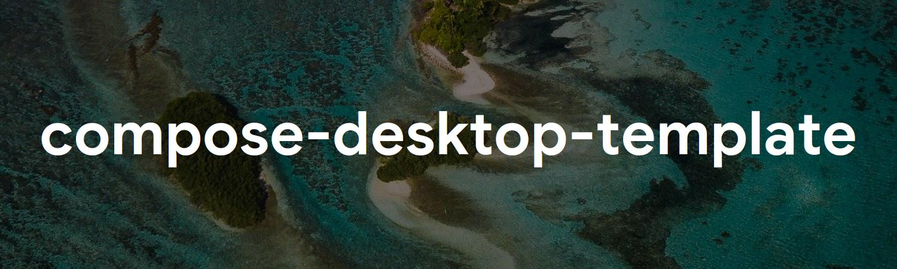

# compose-desktop-template


<a href="https://twitter.com/theapache64" target="_blank">

</a>

> A compose desktop project template with MVVM, Dagger, Decompose and more

### ✨ Demo


## What's included?

- Architecture (MVVM) with Android-ish structure (SingleActivity)
- Dependency Injection (Dagger2)
- Navigation (Decompose)
- Launcher Icons (for all platforms)
- A separate data module
- Testing (both unit tests and UI tests)
- Theme
- Logging
- Font (GoogleSans)

## ⌨️ Use this template

1. Click `Use this template` and create your repo

   

1. Clone your repo and open it in an IDE
1. Replace all `myapp` and `My App` instances with your app name. For this, you can use `Control + Shift + R` for the
   find and replace (IntelliJ)

## OR

## ⌨️ Use the CLI

```shell
~$ sudo npm install -g create-compose-desktop-app
~$ create-compose-desktop-app
Enter project name : 
```

Learn more [here](https://github.com/theapache64/create-compose-desktop-app)

## ✍️ Author

👤 **theapache64**

* Twitter: <a href="https://twitter.com/theapache64" target="_blank">@theapache64</a>
* Email: theapache64@gmail.com

Feel free to ping me 😉

## 🤝 Contributing

Contributions are what make the open source community such an amazing place to be learn, inspire, and create. Any
contributions you make are **greatly appreciated**.

1. Open an issue first to discuss what you would like to change.
1. Fork the Project
1. Create your feature branch (`git checkout -b feature/amazing-feature`)
1. Commit your changes (`git commit -m 'Add some amazing feature'`)
1. Push to the branch (`git push origin feature/amazing-feature`)
1. Open a pull request

Please make sure to update tests as appropriate.

## ❤ Show your support

Give a ⭐️ if this project helped you!

<a href="https://www.patreon.com/theapache64">
  
</a>

<a href="https://www.buymeacoffee.com/theapache64" target="_blank">
    
</a>

## 📝 License

```
Copyright © 2021 - theapache64

Licensed under the Apache License, Version 2.0 (the "License");
you may not use this file except in compliance with the License.
You may obtain a copy of the License at

   http://www.apache.org/licenses/LICENSE-2.0

Unless required by applicable law or agreed to in writing, software
distributed under the License is distributed on an "AS IS" BASIS,
WITHOUT WARRANTIES OR CONDITIONS OF ANY KIND, either express or implied.
See the License for the specific language governing permissions and
limitations under the License.
```

_This README was generated by [readgen](https://github.com/theapache64/readgen)_ ❤